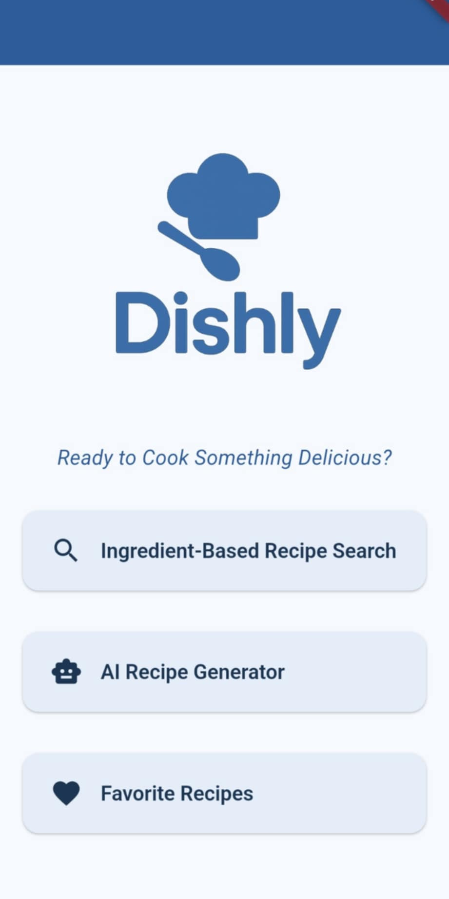
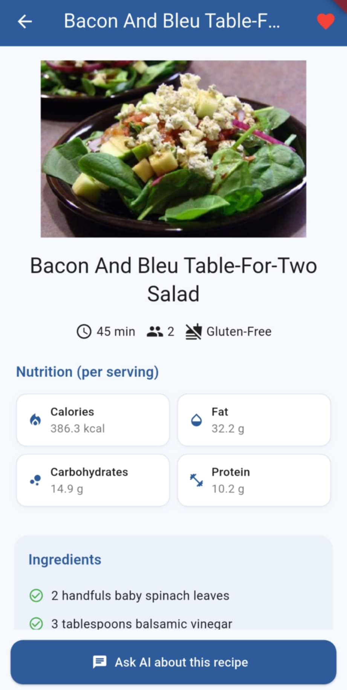

# 🍽️ Dishly

Dishly is a mobile application designed to simplify home cooking by leveraging AI. It helps users discover recipes based on the ingredients they already have, generate new ideas, and receive real-time guidance while cooking.

---

  
  &nbsp;
  

---

## 📱 Features

- **Ingredient-Based Recipe Search**: Input a list of ingredients to retrieve matching recipes.
- **AI-Powered Recipe Generation**: Generate complete recipes based on user-provided ideas or themes.
- **Interactive Recipe Details**: View comprehensive recipe information, including images, preparation time, servings, nutrition facts, ingredients, and step-by-step instructions.
- **Real-Time AI Assistance**: Engage in a chat with an AI assistant for cooking tips, substitutions, and guidance.
- **Favorites Management**: Save and organize preferred recipes for easy access.

---

## 🛠️ Technologies Used

- **Frontend**: Flutter (Dart) for cross-platform mobile development.

- **Backend**:
  - Python with FastAPI for API development.
  - LangChain integrated with local LLaMA 3 models via Ollama for AI functionalities.
  - C# backend following Onion Architecture for scalability and modularity.

- **Database**: MongoDB for storing user interactions and recipe data.

- **Communication**: WebSocket and REST APIs for real-time and standard data exchange.
